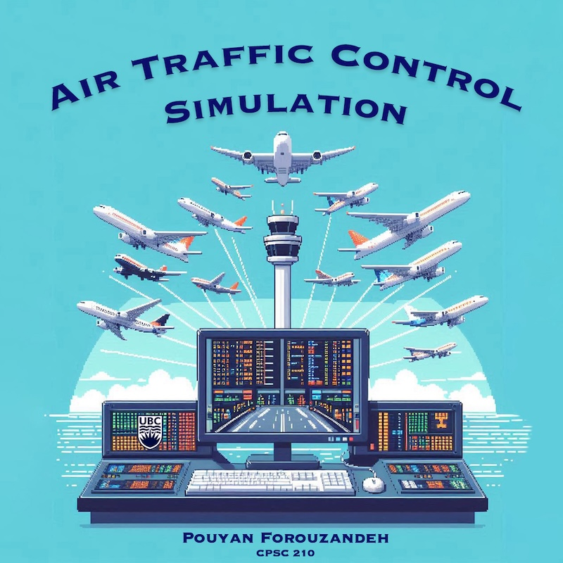
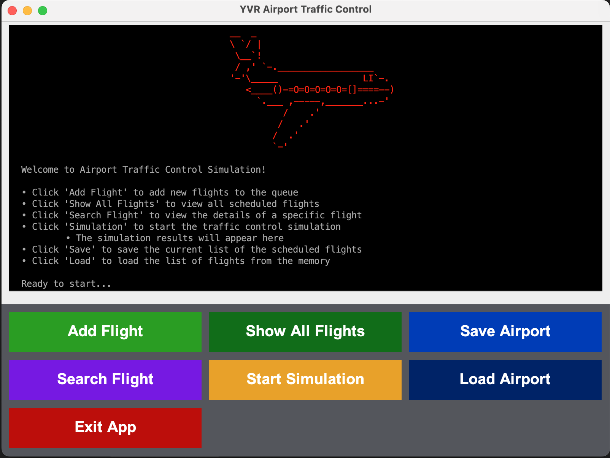

# Air Traffic Control Simulation
## A Java-based Application for Flight Management

  

The **Air Traffic Control Simulation** project aims to design an application that simulates the functionalities of an air traffic control system. This application will manage aircraft movements, ensure safe landings and takeoffs, and provide real-time updates on flight statuses. Users of this application will primarily be students and educators in the fields of computer science and transportation engineering, who seek to understand the complexities of air traffic management through a hands-on simulation experience.

This project is of particular interest to me due to my background in civil engineering and my fascination with transportation systems. I believe that developing this simulation will not only enhance my programming skills but also allow me to explore the intersection of technology and transportation in a meaningful way.

### Key Features:
- **Real-time Flight Management:** Monitor and control aircraft movements.
- **User-Friendly Interface:** Designed with usability in mind for a smooth user experience.
- **Educational Tool:** A practical resource for learning about air traffic control processes.

## User Stories
- As a user I want to be able to make a new airport and add runways to it.

- As a user, I want to be able to add one or more flights to the air traffic control system.

- As a user, I want to be able to view the list of all flights currently in the system.

- As a user, I want to be able to select an aircraft in my airport and view all its flights.

- As a user, I want to be able to view the result of the simulation.

- As a user, I want to be able to save my flight list to file (if I so choose)

- As a user, I want to be able to load my flight list from file (if I so choose)

## Instructions for End User
- You can "add an X to a Y" by clicking on the 'Add Flight' button.

- You can generate the first required action related to the user story "adding multiple Xs to a Y" by clicking the 'Show All Flights' button, then completing the form.

- You can generate the second required action related to the user story "adding multiple Xs to a Y" by clicking the 'Search Flight' button, then entering the airplane name in the form.

- You can start the simulation by clicking the 'Start Simulation' button and see the results in real-time.

- You can locate my visual component by loading the app and seeing the splash screen.

- You can save the state of my application by either clicking the "Save Airport" button or answering the prompt upon closing the app.

- You can reload the state of my application by either clicking the "Load Airport" button or answering the prompt upon opening the app.

  

## Phase 4: Task 2
### Event Log sample
Application Shutdown Log
 
Event Log

Mon Nov 25 10:18:00 PST 2024  
&nbsp;&nbsp;&nbsp;&nbsp;&nbsp;&nbsp;&nbsp;&nbsp;New runway is added to the airport: Runway1  
Mon Nov 25 10:18:00 PST 2024  
&nbsp;&nbsp;&nbsp;&nbsp;&nbsp;&nbsp;&nbsp;&nbsp;New runway is added to the airport: Runway2  
Mon Nov 25 10:18:55 PST 2024  
&nbsp;&nbsp;&nbsp;&nbsp;&nbsp;&nbsp;&nbsp;&nbsp;Flight added to the airport: 100 Boeing 737  
Mon Nov 25 10:19:18 PST 2024  
&nbsp;&nbsp;&nbsp;&nbsp;&nbsp;&nbsp;&nbsp;&nbsp;Flight added to the airport: 101 Airbus A320  
Mon Nov 25 10:19:54 PST 2024  
&nbsp;&nbsp;&nbsp;&nbsp;&nbsp;&nbsp;&nbsp;&nbsp;Flight added to the airport: 102 Bombardier 7000  
Mon Nov 25 10:20:20 PST 2024  
&nbsp;&nbsp;&nbsp;&nbsp;&nbsp;&nbsp;&nbsp;&nbsp;Flight added to the airport: 103 Boeing 777  
Mon Nov 25 10:20:49 PST 2024  
&nbsp;&nbsp;&nbsp;&nbsp;&nbsp;&nbsp;&nbsp;&nbsp;Flight added to the airport: 104 Airbus A350  
Mon Nov 25 10:21:15 PST 2024  
&nbsp;&nbsp;&nbsp;&nbsp;&nbsp;&nbsp;&nbsp;&nbsp;Flight added to the airport: 105 Airbus A330  
Mon Nov 25 10:21:54 PST 2024  
&nbsp;&nbsp;&nbsp;&nbsp;&nbsp;&nbsp;&nbsp;&nbsp;Flight added to the airport: 106 LaserJet 100  
Mon Nov 25 10:23:04 PST 2024  
&nbsp;&nbsp;&nbsp;&nbsp;&nbsp;&nbsp;&nbsp;&nbsp;Flight added to the airport: 107 Cessna 182  
Mon Nov 25 10:23:18 PST 2024  
&nbsp;&nbsp;&nbsp;&nbsp;&nbsp;&nbsp;&nbsp;&nbsp;The data was saved on the computer at : ./data/airport.json  
Mon Nov 25 10:23:24 PST 2024  
&nbsp;&nbsp;&nbsp;&nbsp;&nbsp;&nbsp;&nbsp;&nbsp;Flight landed successfully: 100 Boeing 737  
Mon Nov 25 10:23:24 PST 2024  
&nbsp;&nbsp;&nbsp;&nbsp;&nbsp;&nbsp;&nbsp;&nbsp;Flight departed successfully: 101 Airbus A320  
Mon Nov 25 10:23:24 PST 2024  
&nbsp;&nbsp;&nbsp;&nbsp;&nbsp;&nbsp;&nbsp;&nbsp;Flight landed successfully: 102 Bombardier 7000  
Mon Nov 25 10:23:24 PST 2024  
&nbsp;&nbsp;&nbsp;&nbsp;&nbsp;&nbsp;&nbsp;&nbsp;Flight landed successfully: 103 Boeing 777  
Mon Nov 25 10:23:24 PST 2024  
&nbsp;&nbsp;&nbsp;&nbsp;&nbsp;&nbsp;&nbsp;&nbsp;Flight was put on the head of the queue: 104 Airbus A350  
Mon Nov 25 10:23:24 PST 2024  
&nbsp;&nbsp;&nbsp;&nbsp;&nbsp;&nbsp;&nbsp;&nbsp;Flight was put on the head of the queue: 105 Airbus A330  
Mon Nov 25 10:23:24 PST 2024  
&nbsp;&nbsp;&nbsp;&nbsp;&nbsp;&nbsp;&nbsp;&nbsp;Flight departed successfully: 105 Airbus A330  
Mon Nov 25 10:23:24 PST 2024  
&nbsp;&nbsp;&nbsp;&nbsp;&nbsp;&nbsp;&nbsp;&nbsp;Flight departed successfully: 104 Airbus A350  
Mon Nov 25 10:23:24 PST 2024  
&nbsp;&nbsp;&nbsp;&nbsp;&nbsp;&nbsp;&nbsp;&nbsp;Flight landed successfully: 106 LaserJet 100  
Mon Nov 25 10:23:24 PST 2024  
&nbsp;&nbsp;&nbsp;&nbsp;&nbsp;&nbsp;&nbsp;&nbsp;Flight landed successfully: 107 Cessna 182  
Mon Nov 25 10:23:40 PST 2024  
&nbsp;&nbsp;&nbsp;&nbsp;&nbsp;&nbsp;&nbsp;&nbsp;The data was saved on the computer at : ./data/airport.json  

 End of Log  
Goodbye!

## Phase 4: Task 3
### Refactoring Possibilities
- **Refactor Airplane into Subclasses for Different Types of Airplanes:**  
  Introduce a type hierarchy for airplanes by creating subclasses for different types (e.g., Passenger, Cargo, Private ,...). This would allow the Airport class to handle airplane-specific logic more effectively by encapsulating unique behaviors in the respective subclasses.

- **Refactor AirportApp and AirportAppGUI to Remove Redundancy:**  
  Both AirportApp and AirportAppGUI share similarities in their implementation, which leads to duplication. Extract shared functionality into a common abstract class and refactor their designs to focus on their unique responsibilities. This would make the code easier to maintain and extend.

- **Reduce Coupling Between Runway and Flight:**  
  The current design couples Runway and Flight, which limits flexibility and increases dependencies. Refactor by introducing an intermediary class or interface (e.g., RunwayManager) to manage the assignment of flights to runways.